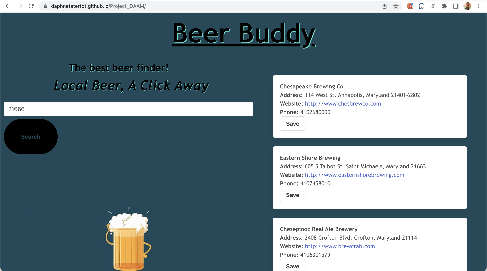

## Beer Buddy

## Description
- Beer Buddy is a simple to use local brewery locator that displays the top 10 breweries searched within a zipcode.  
- It is used to quickly locate breweries near you, displaying address, website, and even phone number!
- We use two API's, one to pull latitude and lingitude coordinates from the zip code entered called zipopotam.us
- the second one is used to locate the 10 closest breweries to that latitude/longitude called openbrewerydb
- Once displayed, the user has the ability to save up to 5 breweries to their favorites list for next time!
- Our CSS framework choice was Bulma

## Roadmap
- Add a "view more options" button, on the off chance that none of the 10 already displayed just don't suffice, or you've already been to them all!
- Add a nav bar as features get added, to make maneuvering around the website seamless
- Add a beer education section, perhaps as a section in the nav bar
- Include the ability to click the address link and be redirected to your preferred navigation system
- New brewery alerts for your favorite areas

##
Without Further Ado:
- [Link To Page](https://daphnetatertot.github.io/Project_DAAM/)

### Authors: Daphne Tate, Anthony Reedy, and Martin Cespedes
